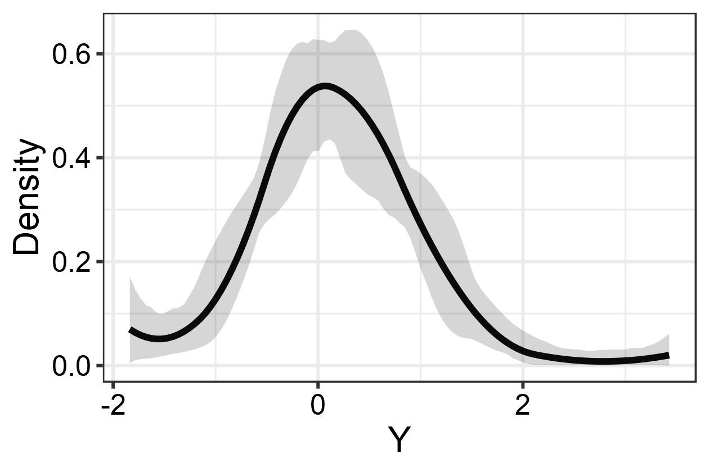

<!-- README.md is generated from README.Rmd. Please edit that file -->

# SPQR: Semi-Parametric Quantile Regression

<!-- badges: start -->

[](https://github.com/stevengxu/SPQR/actions)
<!-- badges: end -->

The `SPQR` R package implements the semi-parametric quantile regression
(SPQR) method in Xu and Reich (2021) [\[1\]](#1). It allows flexible
modeling of the conditional distribution function and quantile function.
The package provides three estimation procedures: maximum likelihood
estimation (MLE) and maximum a posteriori (MAP) which are point
estimates but computationally lighter, and Markov chain Monte Carlo
(MCMC) which is fully Bayesian but computationally heavier. The MLE and
MAP estimates are obtained using the Adam routine in `torch`, whereas
the MCMC estimate is obtained using Stan-like Hamiltonian Monte Carlo
(HMC) and no-U-turn sampler (NUTS).

## Installation

You can install the development version of SPQR from
[GitHub](https://github.com/) with:

``` r
# install.packages("devtools")
devtools::install_github("stevengxu/SPQR")
```

## Example

Estimate normal mixture distribution:

``` r
library(SPQR)
set.seed(919)
n <- 200
X <- rbinom(n, 1, 0.5)
Y <- rnorm(n, X, 0.8)
control <- list(iter = 300, warmup = 200, thin = 1)
fit <- SPQR(X = X, Y = Y, method = "MCMC", control = control, normalize = TRUE, verbose = FALSE)

## summarize output
print(fit, showModel = TRUE)
#> 
#> SPQR fitted using MCMC approach with ARD prior<U+0001F680>
#> 
#> Model specification:
#>     Layers
#>    Input Output Activation
#>        1     10       tanh
#>       10     10    softmax
#> 
#> MCMC diagnostics:
#>   Final acceptance ratio is 0.94 and target is 0.9
#> 
#> Expected log pointwise predictive density (elpd) estimates:
#>   elpd.LOO = 92.49707,  elpd.WAIC = 92.43618
#> 
#> Elapsed time: 0.25 minutes

## plot estimated PDF with 95% credible bands
plotEstimator(fit, type = "PDF", X = 0, ci.level = 0.95)
```



## References

<a id="1">\[1\]</a> Xu, S.G. and Reich, B.J., 2021. Bayesian
nonparametric quantile process regression and estimation of marginal
quantile effects. Biometrics.
